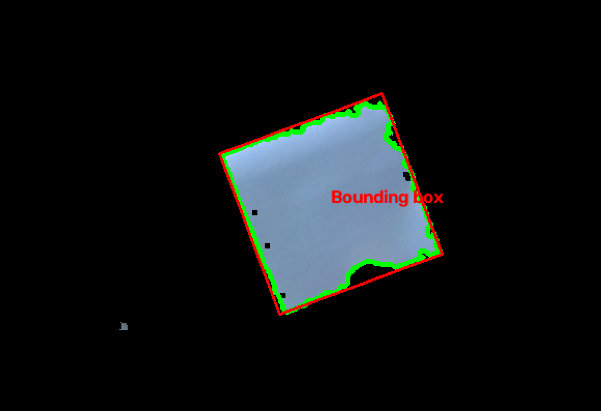

# DEVLOG — Autonomous Target Detection and Tracking System

A running log of progress, decisions, and reasoning behind this portfolio project (YOLOv8 + PyTorch + OpenCV target detection and tracking, stress-tested against operational degradation). Entries are drawn from commit history and working sessions. Private day-to-day debugging notes live in OneNote.

---

## 2026-06-06 — Environment Setup
- Initial repo commit and basic script sanity-testing (`test.py`)
- A few iterations reverting/re-adding test code while getting the local environment and git workflow working

**Reflection:** Slow, deliberate start — worth it to make sure the git workflow was solid before building anything real on top of it.

---

## 2026-06-07 — PyTorch Fundamentals
- Installed and tested PyTorch
- Practised basic tensor manipulation and dtype conversion (float casting)
- Built a working `nn.Linear` layer, then a `Sequential` layer, and used `numel()` to inspect learnable parameters
- Corrected an error in a manual learnable-parameter calculation
- Started a first real model: data/tensor setup for a mammal classifier, followed by an untrained model skeleton

**Reflection:** First real contact with PyTorch's core objects rather than just reading about them — tensors, layers, and parameter counting. Getting the parameter-count calculation wrong and then fixing it was a useful forcing function for understanding what `Linear` layers actually store.

---

## 2026-06-08 — Pandas Practice
- Added a Pandas notebook covering basic data manipulation (`LearningPandas.py`, sample CSVs)

**Reflection:** Short side-step into data-handling basics — relevant later for wrangling dataset annotations, even if not directly part of the model-building thread.

---

## 2026-06-10 to 2026-06-12 — Mammal Classifier: First Training Loop
- Started building out the training loop for the mammal classifier
- Got a training loop running successfully end-to-end
- Extended the model to handle an "unknown animal" case (out-of-distribution input handling)

**Reflection:** Getting a full train loop working — data in, loss computed, weights updated — was the real milestone here, more than the specific mammal-classification task itself.

---

## 2026-06-14 — Refactor + Multi-Class Softmax Classifier
- Refactored the mammal classifier into a dedicated `MammalClassifier/` folder, separating training and inference scripts, and saved the trained model (`.pth`)
- Built a second classifier from scratch in a new `softmaxPractise/` folder — multi-class animal classification using softmax rather than the earlier binary/sigmoid approach — including data (`animals.txt`), training script, and a separate inference script
- Started a third from-scratch exercise: `learningSine.py`, a regression model fitting a sine curve

**Reflection:** A deliberately repetitive day — rebuilding similar classifier logic multiple times (binary → multi-class → regression) from memory rather than relying on one worked example, to actually internalise the `Dataset`/train-loop/inference pattern before moving on.

---

## 2026-06-15 to 2026-06-16 — Regression Practice + Fashion Classifier Started
- Iterated on the sine regression model: fixed a poor initial fit, achieved a good fit over a full 2π range, made fine adjustments, and added a loss-vs-epoch plot
- Removed the now-superseded single-class `MammalClassifier` folder (fully replaced by the softmax version)
- Started a new tutorial-based exercise: a Fashion-MNIST image classifier (`FashionImageClassifier/`)

**Reflection:** Cleaning up superseded code here rather than letting it accumulate — the softmax classifier made the earlier binary version redundant, so it was removed rather than left as clutter.

---

## 2026-06-17 — Fashion Classifier: Class Structure + Training Loop
- Set up the model class and started the training loop for the fashion classifier

*(No commits between 18 and 29 June — this covers a deliberate week off from the project, picked back up in the sessions below.)*

---

## 2026-06-27 — Planning Session: Roadmap, Modules, and Documentation Strategy
No code changes today, but this was the key planning day the rest of the project builds on:
- Finalised the four-phase project roadmap (Foundations → Transfer Learning → Operational-Degradation Stress Testing → Production Deployment), with **Phase 3 (stress testing) identified as the strongest differentiator** for defence-sector recruiters
- Confirmed final-year academic modules: Fluid Mechanics, Numerical Recipes, Modelling and Visualisation, Quantum Computing, Data Acquisition and Handling, plus a TBD elective
- Defined a six-step bridge plan to build ML fluency before starting the core project; confirmed **Step 1 complete** (the tensor/classifier/regression work from 6–17 June, rebuilt from memory rather than copied)
- Decided on a hybrid documentation approach: **OneNote for private day-to-day notes, this `DEVLOG.md` for polished summaries.**
- Confirmed VisDrone (primary) and DOTA (cross-domain) as the datasets to use, both ITAR-compliant

**Reflection:** This is where the project went from "a series of ML exercises" to an actual structured plan with a defence-recruiting angle. Worth having as a fixed reference point going forward.

---

## 2026-06-28 — Project Knowledge Sync
- Investigated ways to keep local project files available to Claude for context (Cowork session access, MCP filesystem connector, third-party sync tools)
- Decided against live sync — settled on uploading markdown summaries manually at project milestones instead, since it's simpler and avoids relying on unsupported tooling

**Reflection:** A small process decision, but one that keeps context management low-maintenance rather than another thing to babysit.

---

## 2026-06-30 — CIFAR-10 Added + Phase 3 Strategy Locked In
- Added CIFAR-10 starter script to the repo
- Reviewed the UK Government's newly published Defence Investment Plan (drone transformation programme, uncrewed naval vessels, Collaborative Combat Air, loitering munitions) and mapped potential project extensions against it
- **Selected "sensor dropout under jamming" as the first Phase 3 addition**, with the rest (multi-object tracking, counter-UAS subset, cross-domain DOTA evaluation, lightweight/quantized variant) queued for later
- Key implementation decisions locked in:
  - **Hand-roll the Kalman filter** (constant-velocity model, from scratch) rather than use a library like FilterPy — deliberately, for interview talking points
  - Model dropout as **realistic burst-pattern blackout**, not uniform random frame loss, to reflect actual EW jamming behaviour
  - Track continuity, position error during coast, and recovery time chosen as the quantitative metrics
  - Build the Kalman filter **right after the YOLOv8 demo** in Phase 2, so Phase 3 extends existing infrastructure instead of being bolted on late

**Reflection:** Probably the most important strategy day so far — it turned "stress testing" from a vague idea into a specific, scoped, and defensible first addition, with a clear reason (both technical and narrative) for building it early rather than late.

---

## 2026-07-02 — Switched to the Official PyTorch CIFAR-10 Tutorial
- Commit: extended the CIFAR-10 training loop, updated the fashion classifier, and added a further from-scratch classifier (`sigmoidPractise/`)
- Decided to drop the in-progress fashion classifier tutorial in favour of the **official PyTorch CIFAR-10 tutorial** (the canonical Colab notebook), for closer alignment with the bridge plan
- Identified the actually-transferable concepts to focus on: `Dataset`/`DataLoader`, transforms, `forward()`, `CrossEntropyLoss`, the optimizer step, and the train/eval loop — explicitly **not** the specific CNN architecture, which won't carry over to YOLOv8
- Decided to do a **from-memory rebuild of the training loop** after finishing the tutorial, as a comprehension check rather than relying on having read the code
- Capped time on this step to avoid scope creep delaying the bridge plan — OpenCV set as the next step after this

**Reflection:** The switch from Fashion-MNIST to the canonical CIFAR-10 tutorial was about matching the bridge plan as originally scoped, not about the fashion classifier being a bad choice — there was real overlap, so nothing was wasted.

---

## 2026-07-05 — Repo Reorganisation + README Drafted
- Commits: added the first project README; reorganised all practice/tutorial code into a single `PractiseExamples/` folder; removed the resulting duplicate top-level files; merged a branch; added CIFAR-10 and Fashion-MNIST dataset files to `.gitignore`

**Reflection:** Cleaning up the repo structure before publishing the README — separating "learning exercises" from the eventual production pipeline — so the repo doesn't read as messy to anyone who clicks in from the README.

---

## 2026-07-06 — README Finalised + First CIFAR-10 Model Test
- Commits: several rounds of README polish (content updates, fixed internal links); started testing the CIFAR-10 model in the notebook; got predictions running but initially inaccurate; tuned learning rate and momentum to bring the loss down; ran a full test-set evaluation
- **Result: ~59% test accuracy** on the full CIFAR-10 test set
- README decisions made this session:
  - **"All rights reserved" instead of an MIT licence** — reluctant to freely distribute the work
  - **GIF over a static image** for the tracking demo, since only a GIF can show persistent track IDs across frames
  - First person for the "why this project" motivation section, neutral voice for technical descriptions
  - Author-section "portfolio" placeholder flagged as referring to a personal site that doesn't exist yet — left as a placeholder rather than a live link

**Reflection:** Two different kinds of work on the same day — polishing the public-facing README, and hitting the model's actual accuracy ceiling for the first time. 59% is a reasonable first pass but well below where a sound pipeline should land, which set up the next session.

---

## 2026-07-07 — Diagnosing CIFAR-10 Training Performance
- Reviewed the 59% test accuracy result against common CIFAR-10 training failure modes ahead of a focused 3–4 hour debugging session
- **Target set: 65–70%+ test accuracy**, as the threshold for confirming the pipeline itself is sound before moving on
- Diagnostic priorities identified: confirm data normalisation uses CIFAR-specific mean/std values, check the learning rate (Adam default of 1e-3 as a baseline), confirm the loss pipeline is using raw logits with `CrossEntropyLoss`, add basic augmentation (random crop + horizontal flip), and extend training with a learning-rate scheduler

**Reflection:** Treating this explicitly as a pipeline-soundness check rather than an architecture problem — the mechanics (`Dataset`/`DataLoader`/train loop) are what carry over to YOLOv8 later, not this specific CNN, so it's worth getting right here rather than chasing accuracy for its own sake.

---

## 2026-07-17 - Final CIFAR-10 Check
- A test accuracy of roughly 62% was achieved. For the purpose of becoming familiar with the image classification pipeline, this is acceptable and this exercise is ended here.
- Final review of the code to confirm understanding, before moving onto investigating OpenCV

---

## 2026-07-07 - Start of OpenCV Exposure
- Target: To create a program that uses a webcam to view and track an object using OpenCV. This is done using HSV (Hue Saturation and Value) thresholding, a binary mask, contouring to eliminate noise, and a bounding box drawn on the output feed.

## 2026-07-21 - Object tracking experimentation
- A test project "objectTracker.py" is created to test openCV and object tracking principles. This is done the a small blue circular lid.
- Initailly it is not realised that OpenCV using HSV ranges [0, 179],[0, 255],[0, 255] meaning object was not tracked at all. Normalising the HSV values to meet these ranges then allowed the blue lid to be separated from its background. 
- An erosion function was added to reduce noise appearing in the edges of the video stream.
- Contouring was explored and implemented, adding a green outline to the feed of the tracked lid.

## 2026-07-31 - Generalising colour range. Improving Contouring
- The colour input is changed so the standard format is input and values are automatically normalised.
- Filtered out all but the largest contour. 
- Added a rotatable bounding box around the largest contour. Labelled the box 